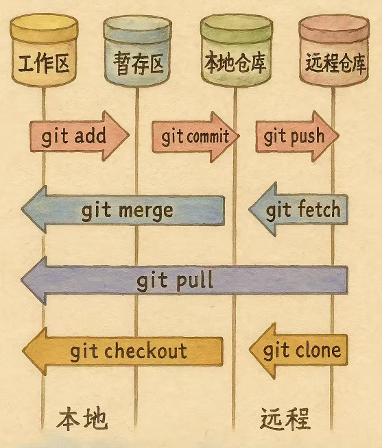
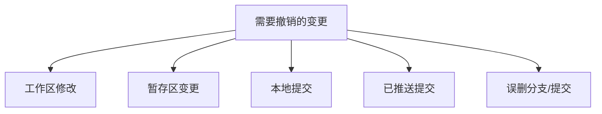
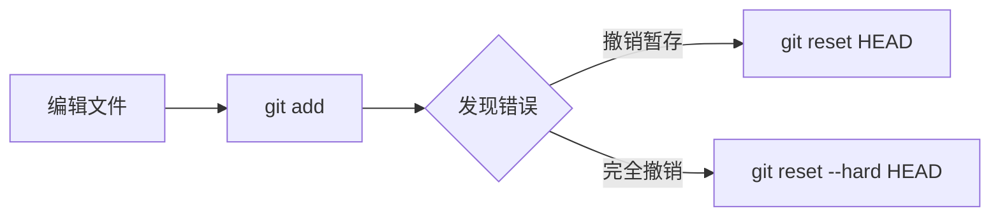
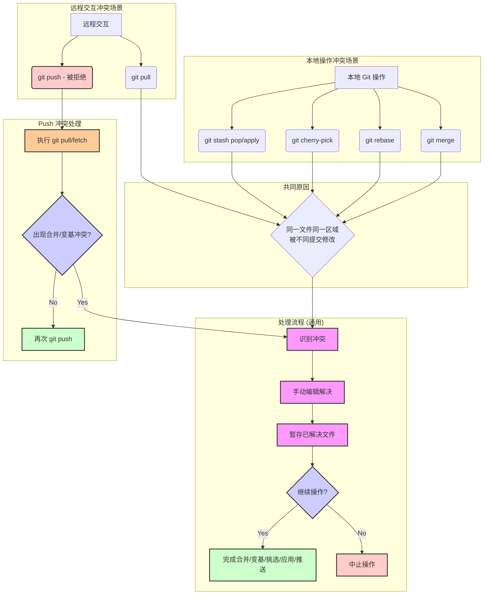
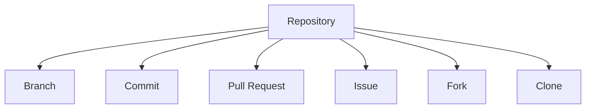
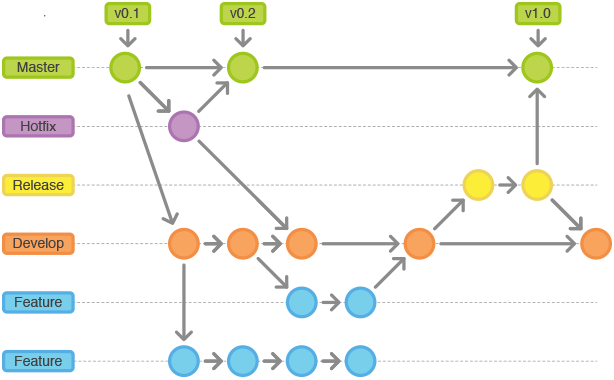
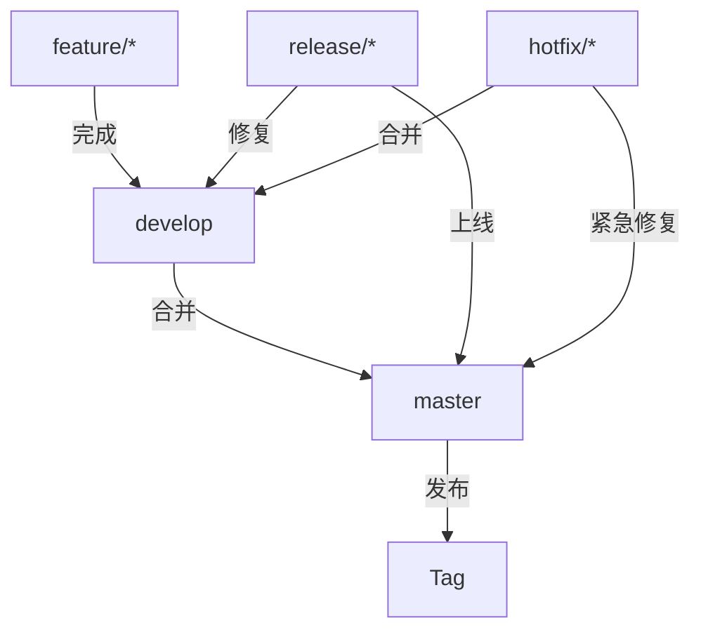
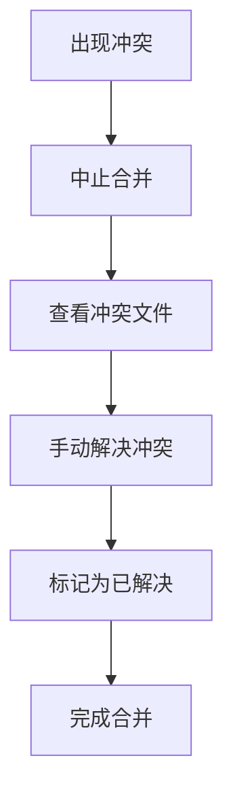

## 1. git基础概念

[git 官方文档](https://git-scm.com/docs)

[git 下载地址](https://git-scm.com/downloads)

[git 沙盒平台](https://learngitbranching.js.org/?locale=zh_CN)

### 1.1 Git与SVN的区别

| 对比维度 | Git           | SVN            |
| ---- | ------------- | -------------- |
| 系统架构 | 分布式版本控制       | 集中式版本控制        |
| 版本存储 | 每个克隆都是完整仓库    | 只保存当前版本，历史在服务器 |
| 分支操作 | 轻量级分支，创建/合并高效 | 分支是目录拷贝，操作成本高  |
| 网络依赖 | 可离线工作，后同步     | 需要持续连接服务器      |
| 提交速度 | 本地提交即时完成      | 必须与服务器交互       |
| 历史修改 | 可修改本地提交历史     | 提交后不可修改历史      |
| 学习曲线 | 概念复杂但功能强大     | 相对简单直观         |
| 适用场景 | 开源项目/分布式团队    | 企业级集中管理        |

### 1.2 4个分区的概念

| 分区名称 | 描述                                               | 常用命令                  |
| -------- | -------------------------------------------------- | ------------------------- |
| 工作区   | 本地文件系统可见的目录，直接编辑文件的地方         | `git add`, `git checkout` |
| 暂存区   | 临时保存将要提交的变更，是工作区和版本库之间的缓冲 | `git commit`              |
| 本地仓库 | 存储项目完整历史和所有版本，位于.git目录中         | `git push`, `git log`     |
| 远程仓库 | 托管在服务器上的代码仓库，用于团队协作和备份       | `git pull`, `git clone`   |



### 1.3 配置作者和邮箱

#### 1.3.1 全局配置（对所有仓库生效）
```shell
# 设置全局用户名
git config --global user.name "你的名字"
# 设置全局邮箱
git config --global user.email "你的邮箱@example.com"
```

#### 1.3.2 当前仓库配置（仅对当前仓库生效）
```shell
# 进入项目目录后，设置当前仓库用户名
git config user.name "当前仓库专用名字"
# 设置当前仓库邮箱
git config user.email "当前仓库专用邮箱@example.com"
```

#### 1.3.3 查看配置
```shell
# 查看所有配置
git config --list
# 查看特定配置项
git config user.name
git config user.email
```

#### 1.3.4 配置优先级
1. 当前仓库配置（最高优先级）
2. 全局配置
3. 系统配置（最低优先级）

### 1.4 忽略某些文件

#### 1.4.1 .gitignore文件作用
用于指定Git应该忽略的文件和目录，这些文件不会被纳入版本控制

#### 1.4.2 语法规则
| 模式     | 示例             | 说明                        |
| -------- | ---------------- | --------------------------- |
| 精确匹配 | `/debug.log`     | 忽略根目录下的debug.log文件 |
| 目录匹配 | `temp/`          | 忽略所有temp目录            |
| 通配符   | `*.log`          | 忽略所有.log文件            |
| 否定规则 | `!important.log` | 不忽略important.log文件     |
| 双星号   | `**/logs`        | 忽略所有目录下的logs文件夹  |

#### 1.4.3 常见忽略项
下面给出Keil Vision Project的忽略文件模版，更多项目的忽略文件模版请参考 [Github gitignore](https://github.com/github/gitignore)

```gitignore
# git ignore file for Keil ?Vision Project

# ?Vision 5 and ?Vision 4 Project screen layout file
*.uvguix.*
*.uvgui.*

# Listing Files
*.i
*.lst
*.m51
*.m66
*.map

# Object Files
*.axf
*.b[0-2][0-9]
*.b3[0-1]
*.bak
*.build_log.htm
*.crf
*.d
*.dep
*.elf
*.htm
*.iex
*.lnp
*.o
*.obj
*.sbr
*._ii
*.__i
*._ll

# Firmware Files
*.bin
*.h86
*.hex

# Build Files

# Debugger Files
.ini

# JLink Files
JLinkLog.txt

# Other Files
.svn/
.cache/
*.pdf
*.xlsx
tool/
compile_commands.json
*.zip
.vscode/
```

#### 1.4.4 使用方法
1. 在项目根目录创建`.gitignore`文件
2. 添加需要忽略的文件模式
3. 提交到版本库：
```shell
git add .gitignore
git commit -m "添加gitignore文件"
```

#### 1.4.5 注意事项
1. 对已跟踪的文件无效，需要先移除跟踪：
```shell
git rm --cached 文件名
```
2. 全局忽略配置（适用于所有仓库）：
```shell
git config --global core.excludesfile ~/.gitignore_global
```

## 2. vscode上的git插件

### 2.1 Git可视化工具
1. **Git Graph**：
   - commit对比：通过点击一个提交，然后按住 CTRL/CMD 键点击另一个提交，可以比较任意两个提交
     - 点击任意文件变更，查看所选提交之间该文件的 Visual Studio Code 差异对比
     - 打开所选提交之间受影响的任意文件的当前版本
     - 将所选提交之间受影响的任意文件路径复制到剪贴板
   - 更多设置
   - cherry pick功能

2. **GitLens**：
   - 增强的commit历史查看
   - 支持commit message模板
   - 查看分支时间线
   - 快速切换分支
   - 可视化子模块与主项目的关系
   - 可视化Hook执行结果

### 2.2 代码提交相关
1. **Git Commit Message Editor**：
   - 提供commit模板和格式验证
   - 支持Conventional Commits规范

2. **Conventional Commits**：
   - 自动生成符合规范的commit message
   - 提供type选择菜单

### 2.3 团队协作相关
1. **GitHub Pull Requests**插件：
   - 直接在编辑器查看/评论PR
   - 本地检查PR分支
   - 提交审查意见
   - 快速切换PR分支

2. **GitHub Issues**插件：
   - 创建/管理issue
   - 快速过滤标签

### 2.4 Git工作流支持
1. **Git Flow**插件：
   - 可视化git flow命令
   - 一键完成分支操作
   - 显示git flow分支关系
   - 颜色区分分支类型

### 2.5 其他集成功能
1. **子模块支持**：
   - 源代码管理视图显示子模块变更
   - 右键子模块可进行初始化/更新

2. **Git Hook支持**：
   - 直接编辑Hook脚本
   - 设置断点调试Hook逻辑

## 3. Git后悔药

### 3.1 撤销场景分类


### 3.2 撤销工作区修改
#### 3.2.1 丢弃单个文件修改
```shell
git checkout -- 文件名
```

#### 3.2.2 丢弃所有修改
```shell
git checkout -- .
```

**典型场景**：修改后未添加到暂存区，想完全放弃所有更改

### 3.3 撤销暂存区变更
#### 3.3.1 将文件移出暂存区（保留工作区修改）
```shell
git reset HEAD 文件名
```

#### 3.3.2 完全撤销暂存区和工作区修改
```shell
git reset --hard HEAD
```

**示例流程**：


### 3.4 撤销本地提交
#### 3.4.1 撤销最近一次提交（保留修改）
```shell
# 保留修改到暂存区
git reset --soft HEAD~1

# 保留修改到工作区
git reset HEAD~1
```

#### 3.4.2 完全撤销提交（慎用）
```shell
git reset --hard HEAD~1
```

#### 3.4.3 修改最近提交（不产生新提交）
```shell
git commit --amend
```

git reset 的三种模式

`git reset` 命令有三种主要模式，它们决定了重置操作对工作区和暂存区的影响：

```
--soft:  保留工作区和暂存区的更改，仅仅将 HEAD 指针移动到指定的提交。
         这意味着所有自 `commit` 以来的更改都会出现在暂存区中，等待重新提交。
--mixed: (默认模式) 保留工作区的更改，但会重置暂存区。
         这意味着所有自 `commit` 以来的更改都会保留在工作区中，变为未暂存状态。
--hard:  同时重置暂存区和工作区，丢弃所有自 `commit` 以来的更改。
         这是一个危险的操作，因为工作区的修改会丢失且难以恢复。
```
**选择策略**：

| 需求        | 命令                        |
| --------- | ------------------------- |
| 仅修改提交信息   | `git commit --amend`      |
| 重做提交并保留更改 | `git reset HEAD~1`        |
| 完全放弃上次提交  | `git reset --hard HEAD~1` |

#### 3.4.4 撤回历史commit（高级用法）
```shell
# 撤回最近3个提交(保留修改到工作区)
git reset HEAD~3

# 完全撤回特定commit及其之后的所有提交(慎用)
git reset --hard 提交hash

# 查看commit历史确定要撤回的范围
git log --oneline --graph
```

**注意事项**：
1. 只能撤回未推送的commit，已推送的commit需要用`git revert`
2. 使用`--hard`会永久删除工作区和暂存区的修改
3. 误操作后可以用`git reflog`找回commit
4. 团队协作分支慎用，会重写历史影响他人

### 3.5 撤销已推送提交
#### 3.5.1 安全撤销（推荐）
```shell
# 创建反向提交
git revert 提交hash
git push
```

#### 3.5.2 强制撤销（慎用）
```shell
# 本地撤销
git reset --hard HEAD~1
# 强制推送
git push origin 分支名 --force-with-lease
```

**reset vs revert**：

| 对比维度     | git reset       | git revert          |
| ------------ | --------------- | ------------------- |
| 适用场景     | 本地/未推送提交 | 已推送提交/团队协作 |
| 是否修改历史 | 是              | 否                  |
| 安全性       | 低（重写历史）  | 高（添加新提交）    |
| 推荐程度     | 个人分支        | 共享分支            |

### 3.6 恢复误删内容
#### 3.6.1 查找历史操作
```shell
git reflog
```

#### 3.6.2 恢复分支/提交
```shell
# 恢复分支
git checkout -b 新分支名 提交hash

# 恢复单个文件
git checkout 提交hash -- 文件名
```

### 3.7 最佳实践
1. **重要操作前备份**：
   ```shell
   git branch backup/feature-xxx
   ```

2. **团队协作规范**：
   - 避免直接`--force`推送
   - 使用`--force-with-lease`更安全
   - 优先使用`revert`而非`reset`

3. **危险操作清单**：
   - `git reset --hard`（不可逆删除工作区）
   - `git push --force`（覆盖远程历史）
   - `git clean -fd`（删除未跟踪文件）

### 3.8 常见问题解决方案
#### 3.8.1 修改了错误的分支
```shell
# 保存当前修改
git stash
# 切换到正确分支
git checkout correct-branch
# 应用修改
git stash pop
```

#### 3.8.2 提交了敏感信息
```shell
# 使用filter-branch清除历史
git filter-branch --force --index-filter \
  "git rm --cached --ignore-unmatch 敏感文件" \
  --prune-empty --tag-name-filter cat -- --all
```

#### 3.8.3 需要拆分大提交
```shell
# 交互式rebase
git rebase -i HEAD~3
# 标记要拆分的提交为edit
# 然后使用git reset HEAD^逐步提交
```

## 4. 分支合并 & 合并冲突

### 4.1 merge
- **定义与作用**：`git merge` 是最常用的分支合并命令，用于将一个分支（源分支）的更改整合到当前所在的分支（目标分支）。
 - **基本用法**：
   ```shell
   # 切换到目标分支（例如 main）
   git checkout main
   # 合并源分支（例如 feature）到当前分支
   git merge feature
   ```
 - **合并类型**：
   - **Fast-forward (快进合并)**：如果目标分支自创建源分支以来没有新的提交，Git 会直接将目标分支指针移动到源分支的最新提交，不产生新的合并提交。历史记录保持线性。
 
   
   - **Three-way Merge (三方合并)**：如果目标分支在源分支创建后也有新的提交，Git 会找到两个分支的共同祖先，并将两个分支的更改进行合并，创建一个新的**合并提交 (Merge Commit)**。这个合并提交有两个父提交。
  
   
 - **合并提交**：三方合并会默认生成一个合并提交，其提交信息通常会自动生成（如 "Merge branch 'feature' into main"），也可以通过 `-m` 参数自定义。使用 `--no-ff` 参数可以强制进行三方合并，即使满足快进合并条件，也会创建一个合并提交，这有助于清晰地标识出特性分支的合并点。
   ```shell
   git merge --no-ff feature -m "Merge feature: Implement user login"
   ```
 - **优点**：
   - 保留了分支的完整历史记录，包括分支的创建和合并点。
   - 对于团队协作，可以清晰地看到每个功能分支的开发和集成过程。
 - **缺点**：
   - 如果分支频繁且合并操作多，可能会导致提交历史变得复杂、非线性，难以阅读。
   - 大量的合并提交可能会“污染”主干分支的历史记录。
 - **适用场景**：
   - 将开发完成的功能分支合并回主开发分支（如 `develop` 或 `main`）。
   - 团队协作中，需要保留清晰的分支合并记录时。
   - 长期运行的分支（如 `release` 分支）合并回主分支。

### 4.2 rebase
 - 将当前分支的提交"重新应用"到目标分支的最新提交后，形成线性历史。
 - 不生成合并提交，但会重写提交历史（适合本地分支）。

#### 4.2.1 基本用法
将当前分支（例如 `feature`）的提交变基到目标分支（例如 `master`）的最新提交上。

```shell
# 切换到你的功能分支
git checkout feature
# 将 feature 分支的提交变基到 master 分支的最新提交上
git rebase master
```

**工作原理**：
1. Git 会找到 `feature` 分支和 `master` 分支的共同祖先提交。
2. Git 会"撤销" `feature` 分支上自共同祖先之后的所有提交，并将这些变更临时保存起来。
3. Git 会将 `feature` 分支指向 `master` 分支的最新提交。
4. Git 会将之前临时保存的变更，按照顺序重新应用（replay）到新的 `feature` 分支顶端。

**效果**：`feature` 分支看起来就像是直接从 `master` 分支的最新状态开发出来的，提交历史变成了一条直线。


#### 4.2.2 Rebase vs Merge

| 特性         | `git rebase`                     | `git merge`                      |
|--------------|----------------------------------|----------------------------------|
| 历史记录     | 线性、整洁                       | 保留分支合并点，非线性           |
| 合并提交     | 不产生额外的合并提交             | 通常会产生一个合并提交（除非 fast-forward） |
| 提交哈希     | **重写**提交历史（哈希值改变）   | **保留**原始提交历史             |
| 冲突处理     | 可能需要多次解决相似冲突         | 一次性解决所有冲突               |
| 适用场景     | 本地分支整理、同步上游变更       | 合并功能到主分支、保留完整历史   |
| 风险         | **禁止**在已推送的共享分支上使用 | 相对安全，但历史可能较复杂       |

#### 4.2.3 交互式 Rebase (`rebase -i`)
交互式 Rebase 提供了更强大的提交历史修改能力。

```shell
# 查看并编辑最近的 3 个提交
git rebase -i HEAD~3
```
执行后会打开一个编辑器，列出指定的提交，你可以修改指令来操作这些提交：
- `pick` (p): 保留该提交（默认）
- `reword` (r): 保留提交，但修改提交信息
- `edit` (e): 保留提交，但暂停 Rebase，允许你修改提交内容（例如拆分提交）
- `squash` (s): 将该提交与前一个提交合并，合并提交信息
- `fixup` (f): 类似 `squash`，但丢弃该提交的提交信息
- `drop` (d): 删除该提交

**用途**：
- 合并多个小的、临时的提交。
- 修改不满意的提交信息。
- 重新排序提交。
- 拆分过大的提交。
- 删除不需要的提交。

#### 4.2.4 使用 Rebase 的风险与建议
- **黄金法则：永远不要在已经推送到共享仓库（如 `origin/main`）的分支上使用 `rebase`！** 因为 `rebase` 会重写历史，如果其他人已经基于旧的历史进行了开发，强制推送 `rebase` 后的分支会导致他们的工作混乱。
- 在个人开发分支上，`rebase` 是保持提交历史清晰的好方法。
- 在将本地功能分支推送到远程或发起 Pull Request 之前，可以使用 `rebase -i` 来整理提交历史，使其更清晰、更有逻辑性。
- 从主分支（如 `main`）拉取更新时，使用 `git pull --rebase` (或 `git fetch` + `git rebase origin/main`) 可以避免不必要的合并提交，保持本地分支历史的线性。


### 4.3 cherry-pick

#### 4.3.1 定义与作用
`git cherry-pick` 命令用于选择一个或多个已存在的提交，并将它们作为新的提交应用到当前所在的分支上。它允许你"挑选"特定的提交，而不是合并整个分支。

#### 4.3.2 基本用法
```shell
# 挑选单个提交
git cherry-pick <commit-hash>

# 挑选多个提交（按顺序应用）
git cherry-pick <commit-hash-1> <commit-hash-2> <commit-hash-3>

# 挑选一个连续范围的提交（不包含 start-commit，包含 end-commit）
git cherry-pick <start-commit-hash>^..<end-commit-hash>
```

#### 4.3.3 应用场景
- **挑选 Bug 修复**：将某个开发分支上的关键 Bug 修复提交应用到稳定版或发布分支，而无需合并整个开发分支。
- **选择性功能引入**：从一个实验性分支挑选某个已完成的小功能提交到主开发分支。
- **避免不必要的合并**：当只需要某个分支的少数几个提交时，使用 `cherry-pick` 比合并整个分支更简洁。
- **恢复丢失的提交**：在某些复杂场景下（如 `rebase` 误操作后），可以从 `reflog` 中找到丢失的提交哈希，并使用 `cherry-pick` 恢复到当前分支。

#### 4.3.4 与 Merge/Rebase 的区别
- **Merge**: 合并两个分支的所有差异，通常会创建一个新的合并提交（除非是 fast-forward），保留分支历史。
- **Rebase**: 将一个分支的提交"变基"到另一个分支上，重写提交历史，使历史线性化。
- **Cherry-pick**: 复制一个或多个提交到当前分支，每个被挑选的提交都会在当前分支上创建一个**新的提交**（拥有新的哈希值，但内容和原始提交相同）。

#### 4.3.5 注意事项与风险
- **产生新的提交哈希**：`cherry-pick` 默认会创建新的提交，即使内容完全一样。如果同一个提交后续又通过 `merge` 进入当前分支，可能会导致提交记录看起来重复。
- **依赖关系**：被挑选的提交可能依赖于它之前的其他提交。如果只挑选部分提交，可能会导致代码无法编译或运行。
- **冲突**：与 `merge` 和 `rebase` 一样，`cherry-pick` 也可能遇到代码冲突，需要手动解决。
- **替代方案**：如果需要挑选一个分支上的**连续多个**提交，通常使用 `rebase` 会更方便和清晰。

### 4.4 git stash

#### 4.4.1 定义与作用
`git stash` 命令用于临时保存当前工作目录和暂存区的状态（未提交的修改），以便你可以切换到其他分支工作或拉取远程更新，而不用担心丢失当前的工作进度。当你准备好回来继续工作时，可以恢复（pop 或 apply）之前保存的状态。

#### 4.4.2 常用命令

| 命令                       | 描述                                                                 |
| -------------------------- | -------------------------------------------------------------------- |
| `git stash save "message"` | 保存当前状态，并附带一条描述信息（可选）                             |
| `git stash`                | `git stash save` 的简写形式                                          |
| `git stash list`           | 查看所有保存的 stash 列表                                            |
| `git stash show [stash@{n}]` | 显示指定 stash（默认为最新）与它基于的 commit 之间的差异             |
| `git stash apply [stash@{n}]`| 应用指定的 stash（默认为最新），但不从 stash 列表中删除              |
| `git stash pop [stash@{n}]`  | 应用指定的 stash（默认为最新），并从 stash 列表中删除                |
| `git stash drop [stash@{n}]` | 删除指定的 stash（默认为最新）                                       |
| `git stash clear`          | 删除所有 stash                                                       |
| `git stash branch <new-branch-name> [stash@{n}]` | 基于指定 stash 创建一个新分支并应用 stash |

#### 4.4.3 包含未跟踪/忽略文件

默认情况下，`git stash` 只保存已跟踪（tracked）文件的修改。
- `git stash -u` 或 `git stash --include-untracked`: 同时保存未跟踪的文件。
- `git stash -a` 或 `git stash --all`: 同时保存未跟踪和被忽略（ignored）的文件。

#### 4.4.4 应用场景

- **切换分支**：当前分支有未完成的工作，但需要紧急切换到另一分支修复 Bug 或进行其他任务。
  ```shell
  # 在 feature 分支工作...
  git stash save "WIP: implementing user profile"
  git checkout hotfix-branch
  # ...修复 Bug...
  git checkout feature
  git stash pop
  ```
- **拉取远程更新**：本地有修改，但想先拉取远程最新代码，避免合并冲突。
  ```shell
  # 本地有修改...
  git stash
  git pull origin main
  git stash pop # 应用之前的修改，可能需要解决冲突
  ```
- **清理工作区**：想暂时移除所有本地修改，查看干净的工作状态。

#### 4.4.5 注意事项

- `stash pop` 如果应用时发生冲突，stash 不会被自动删除，需要手动解决冲突后使用 `git stash drop` 删除。
- Stash 是本地存储，不会随 `git push` 推送到远程仓库。
- 频繁使用 stash 可能意味着提交粒度过大或分支切换策略需要优化。考虑更频繁地提交小的、原子性的更改。


### 4.5 团队协作中的合并建议

1. **分支策略**：
   - 主分支（main/master）应设置为保护分支，禁止直接推送
   - 功能开发使用feature分支，通过PR合并到主分支
   - 使用`--no-ff`合并保留功能开发历史

2. **合并冲突解决流程**：
   ```mermaid
   graph TD
       A[出现冲突] --> B[拉取最新代码]
       B --> C[本地解决冲突]
       C --> D[添加解决后的文件]
       D --> E[提交解决结果]
       E --> F[推送更新]
   ```

3. **代码审查要点**：
   - 合并前必须经过至少一名团队成员审查
   - 使用GitHub/GitLab的PR/MR功能进行代码审查
   - 审查重点：功能完整性、代码质量、测试覆盖

4. **冲突预防**：
   - 频繁从主分支合并更新到开发分支
   - 保持小范围、高频率提交
   - 使用`git diff`提前发现潜在冲突

### 4.6 保持线性提交的方法

1. **使用rebase代替merge**：
   ```shell
   # 从主分支更新时使用rebase
   git pull --rebase origin main
   ```

2. **配置默认rebase行为**：
   ```shell
   # 设置pull时默认使用rebase
   git config --global pull.rebase true
   ```

3. **交互式rebase整理提交**：
   ```shell
   # 整理最近3个提交
   git rebase -i HEAD~3
   ```
   - 使用`squash`合并小提交
   - 使用`reword`修改提交信息
   - 使用`edit`拆分大提交

4. **团队协作注意事项**：
   - 已推送的分支避免使用rebase
   - 公共分支使用merge保留完整历史
   - 个人功能分支使用rebase保持整洁

5. **何时使用merge vs rebase**：

| 场景           | 推荐方式      | 理由                 |
| -------------- | ------------- | -------------------- |
| 公共分支更新   | merge         | 保留完整协作历史     |
| 个人功能分支   | rebase        | 保持线性可读历史     |
| 发布分支合并   | --no-ff merge | 明确功能边界         |
| 长期运行的分支 | 定期merge     | 减少最终合并时的冲突 |
   
### 4.7 合并冲突处理

当 Git 无法自动合并不同分支的更改时，就会发生合并冲突。这通常发生在两个分支修改了同一文件的同一部分。

#### 4.7.1 冲突场景分类



#### 4.7.2 解决冲突步骤详解

1.  **识别冲突**：
    *   执行 `git merge`, `git rebase`, `git cherry-pick`, 或 `git stash pop/apply` 后，如果出现冲突，Git 会提示。
    *   使用 `git status` 查看哪些文件处于冲突状态（Unmerged paths）。

2.  **手动编辑解决**：
    *   打开冲突文件。Git 会在冲突区域用特殊标记标出：
        ```diff
        <<<<<<< HEAD (或当前分支名)
        这是当前分支的内容
        =======
        这是合并分支的内容
        >>>>>>> <合并分支名> (或 commit hash)
        ```
    *   你需要手动编辑这部分代码，删除特殊标记 (`<<<<<<<`, `=======`, `>>>>>>>`)，并保留你期望的最终代码。

3.  **暂存已解决文件**：
    *   解决完一个文件的所有冲突后，使用 `git add <文件名>` 将其标记为已解决。

4.  **继续或中止操作**：
    *   **继续操作**：
        *   对于 `git merge`：所有冲突解决并 `git add` 后，执行 `git commit` (或者如果 Git 自动创建了合并提交，则无需此步，但通常需要 `git merge --continue` 或直接 `git commit`)。
        *   对于 `git rebase`：所有冲突解决并 `git add` 后，执行 `git rebase --continue`。Git 会继续应用下一个补丁，可能需要重复解决冲突。
        *   对于 `git cherry-pick`：所有冲突解决并 `git add` 后，执行 `git cherry-pick --continue` (较新版本 Git) 或 `git commit`。
        *   对于 `git stash pop/apply`：所有冲突解决并 `git add` 后，执行 `git commit` 来完成提交。如果是 `pop` 且冲突，stash 不会自动删除，需手动 `git stash drop`。
    *   **中止操作**：如果你想放弃本次合并/变基等操作，恢复到操作之前的状态：
        *   `git merge --abort`
        *   `git rebase --abort`
        *   `git cherry-pick --abort`
        *   对于 `stash` 冲突，可以使用 `git reset --hard HEAD` 清理工作区（**注意：会丢失未暂存的修改**），然后可能需要 `git stash drop` 清理 stash 记录。

#### 4.7.3 解决冲突工具

*   **VS Code**: 内建了强大的合并冲突解决界面，可以清晰地看到冲突双方的更改，并选择接受哪个版本或手动合并。
*   **Git 图形化工具**: 如 GitKraken, Sourcetree 等也提供了可视化的冲突解决工具。
*   **命令行**: 使用 `git mergetool` 可以调用配置的外部合并工具。

#### 4.7.4 预防冲突

*   **频繁同步**: 经常从主分支（如 `main` 或 `develop`）拉取更新到你的功能分支 (`git pull origin main --rebase`)。
*   **小步提交**: 提交粒度要小，功能单一。
*   **沟通**: 了解团队成员正在修改哪些部分。
*   **清晰的分支策略**: 遵循团队的分支管理规范。

## 5. 如何写好一个commit

### 5.1 规范（Conventional Commits）
推荐使用[Conventional Commits](https://www.conventionalcommits.org/)规范，格式为：
```
<type>[optional scope]: <description>
[optional body]
[optional footer]
```

常用type类型：
- feat: 新功能
- fix: bug修复
- docs: 文档变更
- style: 代码格式/样式调整
- refactor: 代码重构
- perf: 性能优化
- test: 测试相关
- chore: 构建/工具变更

### 5.2 内容要素
1. **标题行**（必填）：
   - 不超过50字符
   - 使用命令式现在时（如"fix"而非"fixed"或"fixes"")
   - 首字母小写
   - 不加句号

2. **正文**（可选）：
   - 解释"为什么"而非"做了什么"
   - 每行不超过72字符
   - 使用空行分隔段落

3. **页脚**（可选）：
   - 关联Issue（如`Closes #123`）
   - 重大变更说明（BREAKING CHANGE）

### 5.3 示例对比
✅ 好的commit:
```
feat: 添加用户登录功能

- 实现JWT认证流程
- 添加登录页面组件
- 增加相关单元测试

Closes #45
```

❌ 不好的commit:
```
更新了登录
```

## 6. github介绍
### 6.1 平台定位
- Git vs GitHub：Git是分布式版本控制系统，GitHub是基于Git的代码托管平台
- 核心功能：代码托管 + 社交编程平台（全球最大开源社区）
- 替代产品：GitLab（企业自建）、Gitee（国内）、Bitbucket

### 6.2 核心概念图解


### 6.3 关键组件解析
1. **Repository（仓库）**
   - 组成要素：
     - 代码文件
     - README.md（项目说明书）
     - LICENSE（开源协议）
     - .gitignore（过滤文件）
     - GitHub特有文件（.github/workflows/")

2. **Workflow 工作流**
   - 标准流程示例：
   ```bash
   Fork -> Clone -> Branch -> Commit -> Push -> Pull Request -> Code Review -> Merge
   ```

3. **社交化功能**
   - Stars：收藏项目
   - Watch：订阅更新
   - Fork：创建副本
   - Follow：关注开发者

### 6.4 GitHub服务矩阵
| 服务名称       | 功能描述                   | 典型场景              |
| -------------- | -------------------------- | --------------------- |
| GitHub Pages   | 静态网站托管               | 个人博客/项目文档     |
| GitHub Actions | 持续集成/持续部署（CI/CD） | 自动化测试与部署      |
| GitHub Gist    | 代码片段分享               | 快速分享配置/示例代码 |
| GitHub Desktop | 图形化客户端               | 可视化操作Git仓库     |

### 6.5 开源动机解析
1. 企业层面：
   - 生态建设（如Linux、FreeRTOS生态）
   - 人才筛选（通过贡献者发现优秀开发者）
   - 标准推广（如Kubernetes、MCP)

2. 个人层面：
   - 构建技术影响力
   - 获得协作开发经验
   - 参与前沿项目

### 6.6 SSH密钥配置
1. 生成密钥对（命令行）
```bash
ssh-keygen -t ed25519 -C "your_email@example.com"
```
- 私钥：~/.ssh/id_ed25519
- 公钥：~/.ssh/id_ed25519.pub

公钥文件是私钥文件的扩展名后加上.pub。公钥用于在服务器上进行认证，而私钥则保留在本地，用于解密从服务器发送回来的信息。

1. 添加公钥到GitHub
   - 位置：Settings -> SSH and GPG keys
   - 验证连接：
   ```bash
   ssh -T git@github.com
   ```
> 补充：如何用命令行把公钥推送到服务器上
> `ssh-copy-id -i ~/.ssh/id_ed25519 your_username@your_server_ip`

### 6.7 添加和管理远程仓库

当你克隆一个仓库时，Git 会自动将原始仓库添加为名为 `origin` 的远程仓库。但你也可以手动添加、重命名和删除远程仓库，甚至关联多个远程仓库。

#### 6.7.1 添加远程仓库

使用 `git remote add` 命令添加一个新的远程仓库。你需要为它指定一个简短的名称（通常使用 `origin` 作为第一个，也是主要的远程仓库）和仓库的 URL。

```shell
# 添加名为 origin 的远程仓库 (通常克隆时自动完成)
# git remote add origin https://github.com/user/repo.git
```

#### 6.7.2 查看远程仓库

使用 `git remote -v` 命令可以查看当前配置的所有远程仓库及其 URL，包括用于 fetch（拉取）和 push（推送）的地址。

```shell
git remote -v
# 输出示例:
# origin  https://github.com/user/repo.git (fetch)
# origin  https://github.com/user/repo.git (push)
```

#### 6.7.3 添加多个远程仓库

一个本地仓库可以关联多个远程仓库。这在多种场景下很有用：

*   **协作 Fork**: 你 fork 了一个项目，需要同时与自己的 fork (`origin`) 和原始项目 (`upstream`) 交互以保持同步。
*   **备份**: 将代码推送到多个不同的托管平台（如 GitHub 和 GitLab）作为备份。
*   **不同部署目标**: 为不同的部署环境（如 Heroku、Vercel）设置不同的远程仓库。

添加第二个或更多远程仓库时，需要给它们指定不同于 `origin` 的、有意义的名称。常见的名称有 `upstream`（用于跟踪原始项目）、`backup`、`heroku` 等。

```shell
# 添加名为 upstream 的远程仓库，指向你 fork 的原始项目
git remote add upstream https://github.com/original-owner/repo.git

# 添加名为 backup 的远程仓库，指向另一个托管平台
git remote add backup https://gitlab.com/user/repo-backup.git

# 再次查看，会列出所有已添加的远程仓库
git remote -v
# 输出示例:
# backup  https://gitlab.com/user/repo-backup.git (fetch)
# backup  https://gitlab.com/user/repo-backup.git (push)
# origin  https://github.com/user/repo.git (fetch)
# origin  https://github.com/user/repo.git (push)
# upstream https://github.com/original-owner/repo.git (fetch)
# upstream https://github.com/original-owner/repo.git (push)
```

#### 6.7.4 与特定远程仓库交互

当你有多个远程仓库时，需要在 `push` 和 `pull` (或 `fetch`) 命令中明确指定要交互的远程仓库名称：

```shell
# 从 upstream 拉取 main 分支的最新更新
git fetch upstream
git merge upstream/main # 或者 git rebase upstream/main

# 或者使用 pull 一步完成 (默认合并)
git pull upstream main

# 将本地 main 分支的更改推送到你自己的 fork (origin)
git push origin main

# 将本地 main 分支的更改也推送到备份仓库 (backup)
git push backup main
```
> **注意**: 如果不指定远程仓库名称（例如 `git pull` 或 `git push`），Git 默认会使用名为 `origin` 的远程仓库。

#### 6.7.5 重命名和删除远程仓库

如果需要修改远程仓库的名称或移除不再需要的远程仓库：

```shell
# 重命名远程仓库 (例如将 origin 改为 github)
git remote rename origin github

# 删除远程仓库 (例如删除 backup)
git remote remove backup
```

## 7. 多人协同

### 7.1 权限管理

#### 7.1.1 GitHub权限模型
| 角色       | 权限范围        | 典型操作            |
| ---------- | --------------- | ------------------- |
| Owner      | 全仓库权限      | 删除仓库/管理团队   |
| Maintainer | 管理分支/合并PR | 设置保护分支/处理PR |
| Developer  | 推送代码/创建PR | 开发新功能/修复bug  |
| Reporter   | 只读访问        | 查看代码/创建issue  |

#### 7.1.2 分支保护规则
1. **保护主分支**：
   ```bash
   # 设置master分支保护
   gh api repos/{owner}/{repo}/branches/master/protection \
     --input protections.json
   ```
   - 必需PR审查
   - 必需CI通过
   - 禁止强制推送

2. **团队协作流程**：
   ```mermaid
   graph LR
     A[开发者] -->|创建分支| B(feature/xxx)
     B -->|推送| C[远程仓库]
     C -->|创建PR| D[审查]
     D -->|批准| E[合并到main]
    ```

### 7.2 合并请求(Pull Request)

#### 7.2.1 PR最佳实践
1. **创建规范"：
   - 关联issue（`Closes #123`）
   - 清晰描述变更目的
   - 保持小范围修改（单一职责）

2. **Code Review要点**：
   - 使用`@mention`指定审查者
   - 针对具体代码行评论
   - 遵循[Google代码审查指南](https://google.github.io/eng-practices/review/)

3. **合并策略选择**：

| 策略   | 适用场景           | 命令示例             |
| ------ | ------------------ | -------------------- |
| Merge  | 保留完整历史       | `git merge --no-ff`  |
| Squash | 简化提交历史       | `git merge --squash` |
| Rebase | 线性历史（需谨慎） | `git rebase main`    |

### 7.3 Issue管理

#### 7.3.1 高效使用Issue
1. **模板配置**：
   ```markdown
   ### 问题描述
   [清晰说明问题现象]

   ### 重现步骤
   1.
   2.
   3.

   ### 预期行为
   [应该发生什么]

   ### 实际行为
   [实际发生了什么]
   ```

2. **标签系统**：
   - `bug`：功能缺陷
   - `enhancement`：功能改进
   - `documentation`：文档问题
   - `help wanted`：需要协助

3. **看板工作流**：
   ```mermaid
   graph LR
     A[Backlog] --> B[In Progress]
     B --> C[Review]
     C --> D[Done]
   ```

### 7.4 git version自动版本管理
#### 7.4.1 目的
在编译C/C++项目时，自动将版本信息（如Git标签、Commit Hash、编译时间）嵌入到代码中，方便追踪软件版本和构建信息。

#### 7.4.2 实现方法：Bash脚本生成头文件

我们可以编写一个Bash脚本，在编译前运行，它会读取当前的Git信息和系统时间，并生成一个C语言头文件（例如 `version.h`）。

**Bash脚本示例 (`generate_version.sh`)**

```bash
#!/bin/bash

# 获取最新的 Git Tag，如果没有 tag 则使用 commit hash 的缩写
# --dirty 会在版本号后附加 -dirty 标记（如果工作区有修改）
GIT_TAG=$(git describe --tags --always --dirty 2>/dev/null)
# 如果上条命令失败（例如不在 Git 仓库中），尝试获取短 commit hash
if [ $? -ne 0 ]; then
  GIT_TAG=$(git rev-parse --short HEAD 2>/dev/null)
fi
# 如果仍然失败，设为未知
if [ $? -ne 0 ]; then
  GIT_TAG="unknown"
fi

# 获取完整的 Git Commit Hash
GIT_COMMIT_HASH=$(git rev-parse HEAD 2>/dev/null)
if [ $? -ne 0 ]; then
  GIT_COMMIT_HASH="unknown"
fi

# 获取构建时间 (UTC)
BUILD_TIME=$(date -u '+%Y-%m-%d %H:%M:%S UTC')

# 定义输出头文件名
OUTPUT_HEADER="version.h"

# 生成头文件内容
cat << EOF > $OUTPUT_HEADER
// Auto-generated by generate_version.sh. Do not edit.
#ifndef VERSION_H
#define VERSION_H

#define VERSION_TAG      "$GIT_TAG"
#define VERSION_COMMIT   "$GIT_COMMIT_HASH"
#define VERSION_BUILD_TIME "$BUILD_TIME"

#endif // VERSION_H
EOF

echo "Generated $OUTPUT_HEADER with version info:"
echo "Tag/Version: $GIT_TAG"
echo "Commit: $GIT_COMMIT_HASH"
echo "Build Time: $BUILD_TIME"

exit 0 # 确保脚本成功退出，以便 Makefile 等工具继续执行
```

**生成的 `version.h` 文件示例**

```c
// Auto-generated by generate_version.sh. Do not edit.
#ifndef VERSION_H
#define VERSION_H

#define VERSION_TAG      "v1.2.3-5-gabcdef-dirty"
#define VERSION_COMMIT   "abcdef1234567890abcdef1234567890abcdef12"
#define VERSION_BUILD_TIME "2025-04-28 05:30:00 UTC"

#endif // VERSION_H
```

#### 7.4.3 集成到编译流程

1.  **保存脚本**: 将上面的 Bash 脚本内容保存为 `generate_version.sh` 文件，并放在项目根目录。
2.  **赋予脚本执行权限**:
    ```bash
    chmod +x generate_version.sh
    ```
3.  **在Makefile或构建脚本中调用**: 在编译C代码之前运行此脚本。

    **Makefile 示例片段**
    ```makefile
    # 定义生成的头文件
    VERSION_HEADER = version.h

    # 定义所有源文件和目标文件
    SOURCES = main.c utils.c
    OBJECTS = $(SOURCES:.c=.o)
    EXECUTABLE = my_program

    # 默认目标：先生成版本文件，然后编译程序
    all: $(VERSION_HEADER) $(EXECUTABLE)

    # 程序链接规则
    $(EXECUTABLE): $(OBJECTS)
    	gcc $(OBJECTS) -o $(EXECUTABLE)

    # C文件的编译规则，依赖于对应的源文件和版本头文件
    %.o: %.c $(VERSION_HEADER)
    	gcc -c $< -o $@

    # 生成版本头文件的规则
    # 将此规则作为所有需要版本信息的编译目标的依赖
    $(VERSION_HEADER): generate_version.sh
    	./generate_version.sh

    # 清理规则
    clean:
    	rm -f $(OBJECTS) $(EXECUTABLE) $(VERSION_HEADER)

    # 将 version.h 声明为 .PHONY 可以确保每次 make 时都尝试执行脚本，
    # 但更好的做法是让编译目标依赖 version.h 文件本身。
    # .PHONY: all clean
    ```
    *说明*: 这个Makefile示例将`version.h`作为编译`.o`文件的依赖。当`generate_version.sh`脚本本身被修改，或者`version.h`文件不存在时，`make`会自动运行脚本来生成或更新`version.h`。

#### 7.4.4 在C代码中使用版本信息

```c
#include <stdio.h>
#include "version.h" // 包含生成的头文件

void print_version() {
    printf("--------------------\n");
    printf(" Program Version : %s\n", VERSION_TAG);
    printf(" Git Commit Hash : %s\n", VERSION_COMMIT);
    printf(" Build Timestamp : %s\n", VERSION_BUILD_TIME);
    printf("--------------------\n");
}

int main() {
    print_version();
    // ... 其他程序逻辑 ...
    return 0;
}
```

#### 7.4.5 注意事项
-   确保执行脚本的环境中有`git`命令并且位于一个有效的Git仓库目录中（或者其子目录）。如果不在Git仓库中，脚本会生成"unknown"版本信息。
-   将生成的 `version.h` 文件添加到 `.gitignore` 中，避免将其提交到版本库，因为它每次构建都可能变化，从而导致不必要的提交。
    ```gitignore
    # Generated files
    version.h
    ```
-   脚本中的错误处理（例如`git`命令失败）可以根据需要进行增强。目前的脚本在`git`命令失败时会输出"unknown"。
-   `git describe --dirty` 会检查工作区是否有未提交的修改，并在版本号后附加 `-dirty` 标记，这对于识别非干净构建很有用。


## 8. gitflow实战

### 8.1 Gitflow工作流模型





### 8.2 核心操作指南

1. **初始化仓库**：
   ```bash
   git flow init
   # 保持默认分支命名或自定义
   ```

2. **功能开发"：
   ```bash
   git flow feature start login-module
   # 开发完成后
   git flow feature finish login-module
   ```

3. **发布准备**：
   ```bash
   git flow release start v1.0.0
   # 测试完成后
   git flow release finish v1.0.0
   ```

4. **紧急修复**：
   ```bash
   git flow hotfix start critical-bug
   # 修复完成后
   git flow hotfix finish critical-bug
   ```

### 8.3 分支管理规范

| 分支类型   | 命名规范  | 生命周期 | 合并目标       |
| ---------- | --------- | -------- | -------------- |
| 主分支     | master    | 永久     | -              |
| 开发分支   | develop   | 永久     | master         |
| 功能分支   | feature/* | 短期     | develop        |
| 发布分支   | release/* | 中期     | master/develop |
| 热修复分支 | hotfix/*  | 短期     | master/develop |

### 8.4 分支合并策略

1. **功能分支合并到develop**：
```bash
# 确保在develop分支
git checkout develop
# 合并功能分支（推荐使用--no-ff保留合并历史）
git merge --no-ff feature/xxx
# 删除已合并的功能分支
git branch -d feature/xxx
```

2. **发布分支合并到master**：
```bash
# 切换到master分支
git checkout master
# 合并发布分支（必须使用--no-ff）
git merge --no-ff release/v1.0
# 打上版本标签
git tag -a v1.0 -m "Release version 1.0"
```

3. **热修复分支合并**：
```bash
# 同时合并到master和develop
git checkout master
git merge --no-ff hotfix/bug123
git checkout develop
git merge --no-ff hotfix/bug123
```

### 8.5 合并最佳实践

1. **合并前准备**：
   - 确保本地分支是最新的（`git pull origin 分支名`）
   - 解决所有本地未提交的更改
   - 运行测试确保代码稳定性

2. **冲突解决流程**：


3. **合并策略选择**：

| 场景         | 推荐策略       | 理由             |
| ------------ | -------------- | ---------------- |
| 功能开发完成 | --no-ff merge  | 保留功能开发历史 |
| 紧急修复     | 快速合并       | 快速部署修复     |
| 长期分支同步 | rebase + merge | 保持历史线性整洁 |

1. **可视化合并流程**：
```bash
# 查看合并情况
git log --graph --oneline --all
# 查看分支关系
git show-branch
```


### 8.6 实战示例

```bash
# 新功能开发完整流程
git flow feature start user-auth
# ...开发代码...
git add .
git commit -m "feat: 实现用户认证逻辑"
git flow feature finish user-auth

# 发布流程
git flow release start v1.2.0
# ...测试过程...
git flow release finish v1.2.0
```

## 9. 如何写好一个PR

### 9.1 PR基本要素

1. **标题规范**：
   - 使用动词开头（如"Fix"、"Add"、"Update"）
   - 包含模块/功能范围（如"[Auth] Fix login redirect"）
   - 不超过60字符

2. **正文结构**：
   ```markdown
   ### 变更概述
   [简明描述PR的目的和主要变更]

   ### 相关Issue
   Close #123 / Fix #234

   ### 变更类型
   - [ ] Bug修复
   - [ ] 功能新增
   - [ ] 重构
   - [ ] 文档更新

   ### 修改内容
   - 文件1：主要变更说明
   - 文件2：调整逻辑说明

   ### 测试验证
   [描述测试方法和验证结果]

   ### 附加说明
   [需要特别注意的事项]
   ```

### 9.2 GitHub PR高效使用

1. **模板配置**：
   ```yaml
   # .github/PULL_REQUEST_TEMPLATE.md
   name: Default PR Template
   about: Describe your changes
   title: '[Area] Brief description'
   labels: ''
   assignees: ''

   ## 变更类型
   <!-- 勾选适用类型 -->
   - [ ] Bug修复
   - [ ] 新功能
   - [ ] 代码重构
   - [ ] 文档更新
   - [ ] 其他

   ## 变更描述
   <!-- 详细说明变更内容 -->

   ## 相关Issue
   <!-- 关联的Issue编号 -->
   Close #

   ## 检查清单
   - [ ] 已通过CI测试
   - [ ] 已更新文档
   - [ ] 已自测主要流程
   ```

2. **高级功能**：
   - **代码行评论**：针对具体代码行提出问题
   - **任务列表**：使用`- [ ]`跟踪待办事项
   - **草稿PR**：标记为`Draft`表示开发中
   - **Reviewers**：指定必要审查者
   - **Labels**：使用标签分类（bug/enhancement等）

3. **审查流程优化**：
   ```mermaid
   graph TD
     A[创建PR] --> B[自动CI]
     B --> C{CI通过?}
     C -->|是| D[请求审查]
     C -->|否| E[修复问题]
     D --> F[审查讨论]
     F --> G{需要修改?}
     G -->|是| H[推送更新]
     G -->|否| I[批准合并]
   ```

### 9.3 VSCode集成技巧

1. **GitHub Pull Requests插件**：
   - 本地查看/评论PR
   - 直接提交审查意见
   - 快速切换PR分支

2. **代码审查建议**：
   - 使用`Changes`视图逐文件审查
   - 利用`Timeline`查看修改历史
   - 通过`Compare Changes`对比差异

### 9.4 优秀PR示例
```markdown
[Auth] 优化JWT过期处理逻辑

### 变更概述
- 修复JWT过期后无限重定向问题
- 增加token自动刷新机制

### 相关Issue
Close #123

### 修改内容
- auth.service.ts: 实现token刷新逻辑
- guard.ts: 优化过期处理流程
- config.ts: 新增refreshToken配置

### 测试验证
1. 手动测试token过期场景
2. 单元测试覆盖率提升至85%
```

## 10. git 子模块

### 10.1 基本概念
Git子模块(Submodule)允许你将一个Git仓库作为另一个Git仓库的子目录。它能让你将其他仓库克隆到自己的项目中，同时还保持独立的提交历史。

### 10.2 核心特点
1. **仓库嵌套**：主项目与子模块各自保持完整Git仓库
2. **版本锁定**：主项目记录子模块的特定提交
3. **独立开发**：子模块可单独更新和提交

### 10.3 使用指南
1. **添加子模块**：
```bash
git submodule add <仓库URL> <路径>
# 示例：添加公共组件库
git submodule add https://github.com/company/ui-components.git src/libs/components
```

2. **初始化子模块**（克隆含子模块的项目后）：
```bash
git submodule init
git submodule update
# 或组合命令
git submodule update --init --recursive
```

3. **更新子模块**：
```bash
# 进入子模块目录后正常操作
cd src/libs/components
git pull origin main

# 返回主项目提交子模块更新
cd ../..
git add src/libs/components
git commit -m "更新子模块版本"
```

4. **删除子模块**：
```bash
# 1. 删除.gitmodules中的配置
# 2. 删除.git/config中的相关部分
# 3. 执行删除
git rm --cached <子模块路径>
rm -rf <子模块路径>
```

### 10.4 使用场景与优势
1. **模块化开发**：
   - 将通用组件/库作为独立仓库维护
   - 多个项目共享同一代码库的不同版本

2. **第三方依赖管理**：
   - 精确控制依赖库的版本
   - 避免直接复制代码带来的同步问题

3. **大型项目组织**：
   - 解耦子系统间的开发周期
   - 各团队可独立维护子模块

### 10.5 注意事项
1. 修改子模块后需要在主项目提交
2. 克隆项目时需添加`--recurse-submodules`参数
3. 子模块更新可能需解决冲突（在主项目和子模块中分别处理）


## 11. git hook

### 11.1 基本概念
Git Hook是Git在特定事件发生时自动运行的脚本，分为客户端Hook和服务器端Hook。它们允许你在关键操作（如提交、推送等）前后插入自定义逻辑。

### 11.2 核心特点
1. **事件驱动**：在特定Git操作前后触发
2. **可定制性**：支持Shell、Python等脚本语言
3. **版本控制**：Hook脚本可纳入版本管理

### 11.3 使用指南
1. **查看可用Hook**：
```bash
ls .git/hooks/
# 示例输出：
# applypatch-msg.sample  pre-commit.sample  pre-push.sample
# commit-msg.sample      pre-rebase.sample  update.sample
```

2. **启用Hook**：
```bash
# 1. 移除.sample后缀
# 2. 添加可执行权限
chmod +x .git/hooks/pre-commit
```

3. **常用客户端Hook**：
- `pre-commit`：在提交前运行，常用于代码检查
- `commit-msg`：检查提交信息格式
- `pre-push`：在推送前运行，常用于运行测试

4. **服务器端Hook**（需Git服务器支持）：
- `pre-receive`：在接收推送前验证
- `update`：按分支验证推送
- `post-receive`：推送后触发通知等

### 11.4 实用案例
1. **代码质量检查**：
```bash
#!/bin/sh
# pre-commit示例：运行ESLint检查
npm run lint
if [ $? -ne 0 ]; then
  echo "Lint检查失败，请修复错误后再提交"
  exit 1
fi
```

1. **提交信息验证**：
```bash
#!/bin/sh
# commit-msg示例：验证Conventional Commits格式

COMMIT_MSG=`cat $1 | egrep "^(feat|fix|docs|chore)\(\w+\)?:\s(\S|\w)+"`

if [ "$COMMIT_MSG" = "" ]; then
  echo "Commit Message 不规范，请检查!\n"
  exit 1
fi

if [ ${#COMMIT_MSG} -lt 15 ]; then
  echo "Commit Message 太短了，请再详细点!\n"
  exit 1
fi

```

1. **自动测试**：
```bash
#!/bin/sh
# pre-push示例：运行单元测试
make test
if [ $? -ne 0 ]; then
  echo "测试失败，请修复后再推送"
  exit 1
fi
```

1. **自动部署**：
```bash
#!/bin/sh
# post-receive示例：自动部署到测试环境
while read oldrev newrev refname
do
  if [ "$refname" = "refs/heads/main" ]; then
    git --work-tree=/var/www/test --git-dir=/var/repo/site.git checkout -f
  fi
done
```

### 11.5 使用好处
1. **自动化流程**：减少手动操作错误
2. **强制规范**：确保团队遵守代码标准
3. **提高质量**：在问题进入仓库前拦截
4. **节省时间**：自动执行重复性任务

### 11.7 注意事项
1. 确保Hook脚本有可执行权限
2. 复杂的Hook可能影响开发体验（如长时间运行）
3. 考虑使用Husky等工具简化Hook管理
4. 服务器端Hook需要管理员权限配置


## 12. Git LFS (Large File Storage)

### 12.1 什么是 Git LFS？
Git 本身不擅长处理大型二进制文件（如图片、视频、音频、数据集、编译产物等）。每次修改大文件，Git 仓库体积会急剧增大，克隆和拉取速度变慢。Git LFS (Large File Storage) 是一个 Git 扩展，用于解决这个问题。它将大文件存储在专门的 LFS 服务器上，而在 Git 仓库中只保存一个轻量级的“指针”文件（包含文件的哈希值和大小等信息）。

### 12.2 工作原理
1.  **安装 LFS 扩展**: `git lfs install` (通常需要为每个仓库或全局安装一次)。
2.  **跟踪文件类型**: 使用 `git lfs track` 命令指定需要 LFS 管理的文件模式（如 `*.psd`, `*.mp4`）。这会创建或修改 `.gitattributes` 文件。
3.  **提交**: 当你 `git add` 一个被 LFS 跟踪的文件时，Git LFS 的 Hook 会介入，将实际文件内容上传到 LFS 服务器，并将文件替换为一个包含指针信息的文本文件。
4.  **克隆/拉取**: 当你克隆仓库或切换分支时，Git LFS 会自动检测指针文件，并从 LFS 服务器下载实际的大文件内容。

### 12.3 使用场景
-   图形设计文件 (PSD, AI)
-   视频和音频文件 (MP4, WAV)
-   大型数据集 (CSV, HDF5)
-   游戏资源 (纹理, 模型)
-   二进制构建产物 (JAR, DLL)

### 12.4 常用命令
```bash
# 安装 LFS (系统范围或仓库范围)
git lfs install       # 为当前用户安装 LFS Hook
git lfs install --system # 为系统所有用户安装

# 跟踪指定类型的文件
git lfs track "*.psd"  # 跟踪所有 .psd 文件
git lfs track "assets/large-files/*" # 跟踪特定目录下的所有文件

# 查看当前跟踪的文件模式
git lfs track

# 查看哪些文件正在被 LFS 管理
git lfs ls-files

# 确保 .gitattributes 文件被提交
git add .gitattributes
git commit -m "Configure Git LFS tracking"

# 正常提交和推送
git add large_file.dat
git commit -m "Add large data file"
git push origin main

# 克隆包含 LFS 文件的仓库 (LFS 会自动下载)
git clone <repository_url>

# 拉取更新 (LFS 会自动下载更新的大文件)
git pull
```

### 12.5 注意事项
-   **LFS 服务器**: 需要有 LFS 服务器来存储大文件。GitHub, GitLab, Bitbucket 等平台都提供 LFS 支持，但通常有存储和带宽限制（超出部分可能收费）。也可以自建 LFS 服务器。
-   **.gitattributes**: 这个文件非常重要，必须提交到仓库，它告诉 Git 哪些文件应该由 LFS 处理。
-   **历史文件**: `git lfs track` 只对之后添加的文件生效。要将仓库历史中的大文件迁移到 LFS，需要使用 `git lfs migrate` 命令，这是一个复杂且可能重写历史的操作。
-   **协作**: 团队成员都需要安装 Git LFS 扩展才能正常工作。
 

## 13. github action

### 13.1 GitHub Actions简介
GitHub Actions是GitHub提供的持续集成和持续交付(CI/CD)平台，允许你自动化构建、测试和部署流程。它可以直接集成在你的GitHub仓库中，通过YAML文件定义工作流，在代码推送或PR等事件触发时自动执行任务。

[自动化工具市场 github actions marketplace](https://github.com/marketplace?type=actions)
[actions说明文档 GitHub Actions documentation](https://docs.github.com/en/actions)

### 13.2 核心概念
1. **Workflow（工作流）**：一个可配置的自动化流程，由YAML文件定义
2. **Job（作业）**：工作流中的一组步骤，在同一个运行器上执行
3. **Step（步骤）**：作业中的单个任务，可以运行命令或操作
4. **Action（动作）**：可重用的代码单元，用于简化工作流步骤
5. **Runner（运行器）**：执行工作流的服务器，可以是GitHub托管或自托管

### 13.3 基本使用方法
1. **创建工作流文件**：
   - 在仓库中创建`.github/workflows/`目录
   - 添加YAML格式的工作流文件（如`ci.yml`）

2. **工作流文件结构**：
```yaml
name: Workflow名称
on: [push, pull_request] # 触发事件
jobs:
  build:
    runs-on: ubuntu-latest # 运行环境
    steps:
      - uses: actions/checkout@v2 # 检出代码
      - run: make # 运行命令
```

3. **常用触发事件**：
   - `push`：代码推送时触发
   - `pull_request`：PR创建或更新时触发
   - `schedule`：定时触发（cron语法）
   - `workflow_dispatch`：手动触发

### 13.4 使用优势
1. **深度集成**：与GitHub生态系统无缝协作
2. **多平台支持**：支持Linux、Windows和macOS运行环境
3. **丰富的Action市场**：数千个预构建Action可供使用
4. **免费额度**：公开仓库和私有仓库都有一定的免费使用额度
5. **矩阵构建**：支持同时测试多个配置/版本

### 13.5 实用案例
1. **自动化测试**：每次推送代码时运行测试套件
2. **持续部署**：自动部署到生产/测试环境
3. **代码质量检查**：运行linter和静态分析工具
4. **发布管理**：自动创建发布包和发布说明
5. **定时任务**：定期运行数据备份或报表生成

### 13.6 自动编译和发布案例
以下是一个完整的workflow示例，实现当创建git tag时自动编译makefile项目并发布到GitHub Release：

```yaml
name: Publish release

on:
  push:
    tags:
      - "v*.*.*"

jobs:
  build:
    runs-on: ubuntu-latest
    steps:
      - name: Checkout
        uses: actions/checkout@v4
      - name: Install arm-none-eabi-gcc
        uses: carlosperate/arm-none-eabi-gcc-action@v1
      - name: Verify version
        run: arm-none-eabi-gcc --version
      - name: build make
        run: make
      - name: ls path
        run: ls Build/
      - name: zip the build
        run: |
          zip -r output.zip Build/GD32F407VET6.bin Build/GD32F407VET6.hex Build/GD32F407VET6.elf
          ls .
      - name: Release
        uses: softprops/action-gh-release@v2
        with:
          token: ${{ secrets.RELEASE_TOKEN }}
          body_path: ./CHANGELOG.md
          files: |
            ./output.zip
            ./CHANGELOG.md

```

### 13.7 实现步骤解析
1. **触发条件**：当推送v开头的tag时触发工作流（如`git tag -a v1.0.0 -m "Release 1.0.0" && git push origin v1.0.0`）
2. **环境准备**：安装build-essential包确保make可用
3. **编译过程**：运行`make all`命令编译项目
4. **创建Release**：使用create-release action基于tag创建GitHub Release
5. **上传产物**：将make生成的构建产物上传到Release中

### 13.8 进阶技巧
1. **使用缓存**：缓存依赖项加速后续构建
2. **矩阵构建**：同时构建多个平台/版本
3. **环境变量**：通过secrets管理敏感信息
4. **条件步骤**：根据上一步结果决定是否执行
5. **人工审批**：重要部署前加入人工确认步骤

### 13.9 VSCode集成
1. **语法高亮**：安装YAML插件获得语法支持
2. **Action验证**：使用GitHub Actions扩展验证工作流
3. **本地测试**：通过act工具本地运行工作流
4. **智能提示**：使用schema获得自动补全功能
